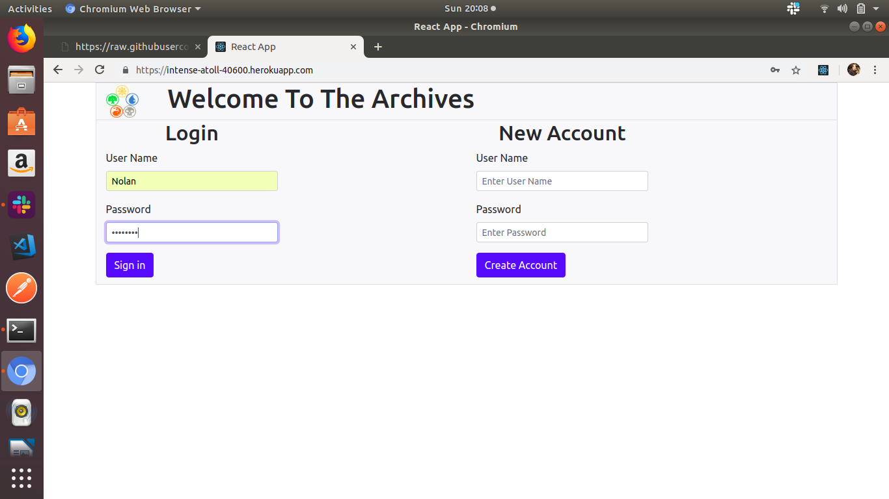
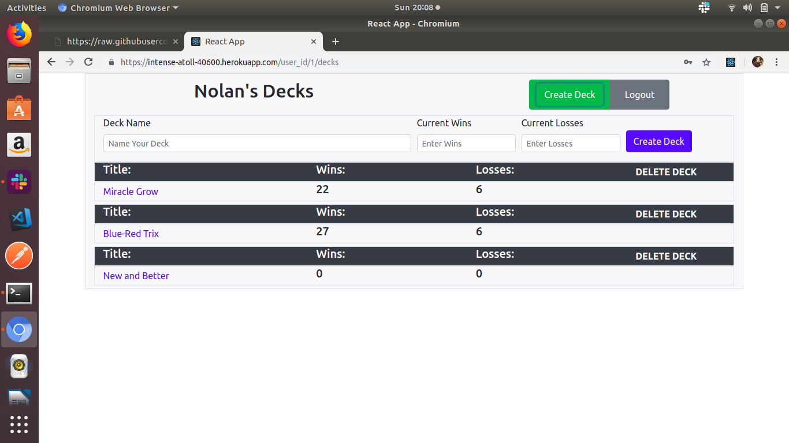
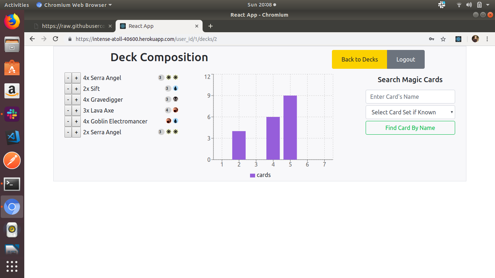
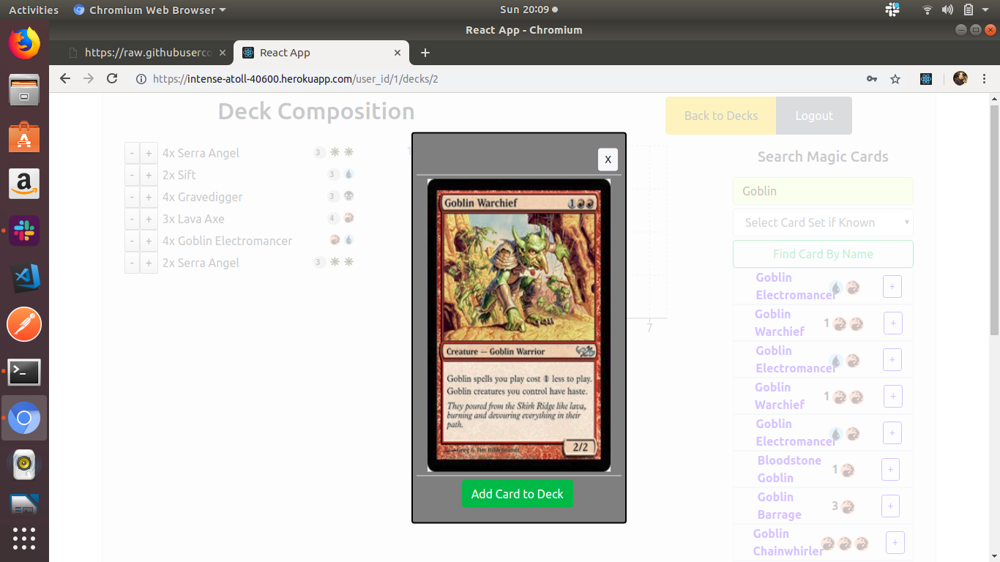

//////////////////////THE ARCHIVES MTG DECK BUILDER//////////////////////////
Front-End react Application for The Achives website

The Archives is a customizable Magic The Gathering Deck Builder and card search resource site.

## Setup

The Archives runs entirely in browser, and is free of charge. Access at http://the-archives-mtg.herokuapp.com/. No installation is required; user's information will be stored in a Heroku database. User needs only to create an account and sign in on the landing page.

## How-to

Upon arriving at the login page users are prompted to either create a new account or login to an existing one.

Users will then be taken to their Decks page. Here they can see a list of decks they have created and create a new deck if they so choose. By clicking on the name of the deck they'll be taken to the Deck Details page.

On the Deck Details page users have 3 columns, The left column lists the current cards that have been added to the deck. The center column which calculates the mana curve for their deck based on the total mana cost for all cards added to the deck and finally the Add Card search field.

The Add Card Search Field access the MTG-API and allowsusers to search thousands of cards by name and set. Users can click on the card title to see the actual card and then add it to their Deck.

This project was bootstrapped with [Create React App](https://github.com/facebook/create-react-app).

## Available Scripts

In the project directory, you can run:

### `npm start`

Runs the app in the development mode. 
Open [http://localhost:3000](http://localhost:3000) to view it in the browser.

The page will reload if you make edits. 
You will also see any lint errors in the console.

### `npm test`

Launches the test runner in the interactive watch mode. 
See the section about [running tests](https://facebook.github.io/create-react-app/docs/running-tests) for more information.

### `npm run build`

Builds the app for production to the `build` folder. 
It correctly bundles React in production mode and optimizes the build for the best performance.

The build is minified and the filenames include the hashes. 
Your app is ready to be deployed!

See the section about [deployment](https://facebook.github.io/create-react-app/docs/deployment) for more information.

### `npm run eject`

**Note: this is a one-way operation. Once you `eject`, you can’t go back!**

If you aren’t satisfied with the build tool and configuration choices, you can `eject` at any time. This command will remove the single build dependency from your project.

Instead, it will copy all the configuration files and the transitive dependencies (Webpack, Babel, ESLint, etc) right into your project so you have full control over them. All of the commands except `eject` will still work, but they will point to the copied scripts so you can tweak them. At this point you’re on your own.

You don’t have to ever use `eject`. The curated feature set is suitable for small and middle deployments, and you shouldn’t feel obligated to use this feature. However we understand that this tool wouldn’t be useful if you couldn’t customize it when you are ready for it.

## Learn More

You can learn more in the [Create React App documentation](https://facebook.github.io/create-react-app/docs/getting-started).

To learn React, check out the [React documentation](https://reactjs.org/).

### Code Splitting

This section has moved here: https://facebook.github.io/create-react-app/docs/code-splitting

### Analyzing the Bundle Size

This section has moved here: https://facebook.github.io/create-react-app/docs/analyzing-the-bundle-size

### Making a Progressive Web App

This section has moved here: https://facebook.github.io/create-react-app/docs/making-a-progressive-web-app

### Advanced Configuration

This section has moved here: https://facebook.github.io/create-react-app/docs/advanced-configuration

### Deployment

This section has moved here: https://facebook.github.io/create-react-app/docs/deployment

### `npm run build` fails to minify

This section has moved here: https://facebook.github.io/create-react-app/docs/troubleshooting#npm-run-build-fails-to-minify
